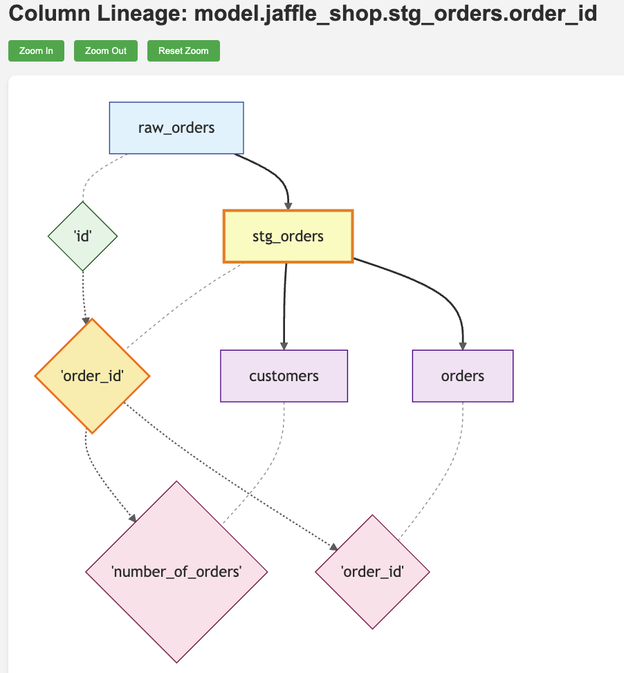

# DBT Column Lineage Extractor

# DISCLAIMER

**WARNING:** This tool is currently in beta and has only been tested on a limited number of dbt projects using the `snowflake` dialect. It might not perform as expected in every situation. Please report any issues or suggestions in the [Repository](https://github.com/canva-public/dbt-column-lineage-extractor)


## Overview

The DBT Column Lineage Extractor is a lightweight Python-based tool for extracting and analyzing data column lineage for dbt projects. This tool utilizes the [sqlglot](https://github.com/tobymao/sqlglot) library to parse and analyze SQL queries defined in your dbt models and maps their column lineage relationships.

## GitHub Repository
[dbt Column Lineage Extractor](https://github.com/canva-public/dbt-column-lineage-extractor)

## Features

- Extract column level lineage for specified model columns, including direct and recursive relationships.
- Output results in a human-readable JSON format for programmatic integration (e.g., data impact analysis, data tagging).
- Visualization of column lineage using Mermaid diagrams
- Support for dbt-style model selection syntax, allowing easy selection of models and sources using familiar patterns.


## Installation
### pip installation
```
pip install dbt-column-lineage-extractor==0.1.7b2
```

## Required Input Files

To run the DBT Column Lineage Extractor, you need the following files:

- **`catalog.json`**: Provides the schema of the models, including names and types of the columns.
- **`manifest.json`**: Offers model-level lineage information.

These files are generated by executing the command:

```bash
dbt docs generate
```

### Important Notes

- The `dbt docs generate` command does not parse your SQL syntax. Instead, it connects to the data warehouse to retrieve schema information.
- Ensure that the relevant models are materialized in your dbt project as either tables or views for accurate schema information.
- If the models aren't materialized in your development environment, you might use the `--target` flag to specify an alternative target environment with all models materialized (e.g., `--target prod`), given you have access to it.
- After modifying the schemas, update the materialized models in your warehouse before running the `dbt docs generate` command.


## Example Usage and Customization

The DBT Column Lineage Extractor can be used in two ways: via the command line interface or by integrating the Python scripts into your codebase.
```bash
cd examples
```

### Option 1 - Command Line Interface

First, generate column lineage relationships to model's direct parents and children using the `dbt_column_lineage_direct` command.

- To scan the whole project (takes longer, but you don't need to run it again for different models if there is no model change):
  ```bash
  dbt_column_lineage_direct --manifest path/to/manifest.json --catalog path/to/catalog.json
  ```

- If only interested in specific models (faster) and their recursive ancestors/descendants, you can use the `--model +model_name+` parameter with support for dbt-style selectors:
  ```bash
  dbt_column_lineage_direct --manifest path/to/manifest.json --catalog path/to/catalog.json --model +orders+
  ```

> ##### Model Selection Syntax
> The tool supports dbt-style model selection syntax. For detailed information on available selectors and usage examples, see the [Model Selection Syntax documentation](./docs/model_selection_syntax.md).

- To then analyze recursive column lineage relationships for a specific model and column using the `dbt_column_lineage_recursive` command:
  ```bash
  dbt_column_lineage_recursive --model model.jaffle_shop.stg_orders --column order_id
  ```

This will:
1. Generate a detailed lineage analysis, outputting the structured lineaged in json and mermaid diagram format.
2. Create a Mermaid diagram visualization in html.

See more usage guides using `dbt_column_lineage_direct -h` and `dbt_column_lineage_recursive -h`.

### Option 2 - Python Scripts
See the [readme file](./examples/readme.md) in the `examples` directory for more detailed instructions on how to integrate the DBT Column Lineage Extractor into your python scripts.

## Outputs

### 1. Mermaid Diagrams for visualization
The tool automatically generates a visualization using Mermaid diagrams.

Example Mermaid visualization:




### 2. JSON-based 
The tool also outputs structured JSON that can be used for programmatic integration, data impact analysis, etc.

Example JSON structure for `model.jaffle_shop.stg_orders -- order_id`

  - Structured Ancestors:
    ```json
    {
      "seed.jaffle_shop.raw_orders": {
         "id": {
               "+": {}
         }
      }
    }
    ```
  - Structured Descendants:
    ```json
    {
      "model.jaffle_shop.customers": {
         "number_of_orders": {
               "+": {}
         }
      },
      "model.jaffle_shop.orders": {
         "order_id": {
               "+": {}
         }
      }
    }
    ```


## Limitations
- Doesn't support parse certain syntax, e.g. lateral flatten
- Doesn't support dbt python models
- Only tested with `snowflake` dialect so far